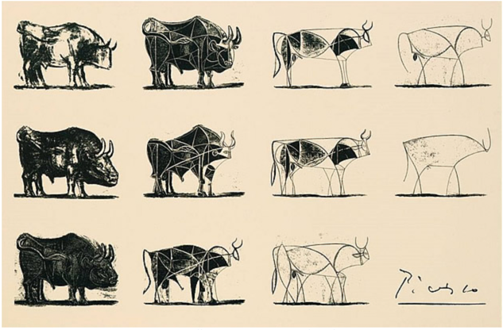

# 미션 - 다리 건너기

## 👍 다시 해보는 연습!
- 객체 지향 구조에 대해서 너무 무지하고 있던 자신이 통탄스러워 다시 해본다.
- SOLID 기본 원칙에 의거하여 찐하게 해보자!

## 🤔 SOLID 는 무엇일까?
### 🤡 S
- Single Responsibility Principle (SRP)

단일 책임 원칙이라고 칭한다.
  
핵심은 모든 클래스는 하나의 책임만을 가지며, 클래스는 그 책임을 완전히 캡슐화해야 함을 일컫는다.
  
결과적으로 클래스를 변경하는 이유는 단 한가지여야 한다는 것이다.
  
클래스가 제공하는 모든 기능은 이 책임과 주의 깊게 부합해야 한다.
  
프리코스 중 가장 중시하였던 원칙인 것 같다.
  
아무래도 단칙 책임 원칙을 지키게 되면 유지보수가 편해지고, 즉 기능을 변경하기가 쉬워지는 장점때문인 것 같다. 
  
단일 책임 원칙을 설명할 수 있는 예를 한번 들어보자.
  
자동차가 있다고 가정해보자.
  
자동차에는 Seat, Heater, Handle ... 등등이 있을 것이다.
  
그리고서 이 모든 것들을 합쳐놓으면 Car 가 되는 것이다.
  
만일 이 경우 나머지 Seat, Heater 등을 나누지 않고 Car 로만 해결하게 된다면?
  
Car 는 기능이 너무 방대해지고, 책임이 모호해질 것이다.
  
그렇게 되면 위에서 말했던 유지보수, 기능 변경에 용의하다는 장점을 얻을 수 없는 것이다.
  
그래서 SRP 를 지켜야 하는 것이다.

그냥 예를 들었던 것을 구현을 대충 해보자.

일단 먼저, 규칙에 위반되는 형식대로 구성해보자.

구현해야 할 조건은 그냥 차에 타서, 운전하기 좋은 상태로 초기 세팅을 한다고 생각해보자.

```java
public class Test {
    public class Car {
        private int angleOfSeat;
        private int temperatureOfHeater;
        private int angleOfHandle;
        
        public void initialSetUp() {
            angleOfSeat = 105;
            temperatureOfHeater = 25;
            angleOfHandle = 0;
        }
    }
    
    public void main(String[] args) {
        Car jaeyeonCar = new Car();
        jaeyeonCar.initialSetUp();
    }
}
```

이렇게 하게 되면, 이런 간단한 것들은 훨씬 쉬울지 몰라도, 만일 가져야 하는 정보, 상태등이 많다면 너무 복잡하고 커지게 된다.

그래서 적절하게 책임을 분리시키면 아래와 같이 할 수 있을 것 같다.

```java
public class Test {
    public class Car {
        private Heater heater;
        private Seat seat;
        private Handle handle;
    
        public Car() {
            this.heater = new Heater();
            this.seat = new Seat();
            this.handle = new Handle();
        }
    
        public void initialSetUp() {
            heater.initialSetUp();
            seat.initialSetUp();
            handle.initialSetUp();
        }
    }
  
    public class Seat {
        private int angleOfSeat;
    
        public void initialSetUp() {
            angleOfSeat = 105;
            System.out.println("의자 각도 : " + angleOfSeat);
        }
    }
  
    public class Heater {
        private int temperatureOfHeater;
    
        public void initialSetUp() {
            temperatureOfHeater = 25;
            System.out.println("히터 온도 : " + temperatureOfHeater);
        }
    }
  
  
    public class Handle {
        private int angleOfHandle;
    
        public void initialSetUp() {
          angleOfHandle = 0;
          System.out.println("핸들 각도 : " + angleOfHandle);
        }
    }

    public void main(String[] args) {
        Car jaeyeonCar = new Car();
        jaeyeonCar.initialSetUp();
    }
}
```

이걸로 조금 더 코드는 많아질 수 있겠지만 후에도 설명할 유지보수 측면에서 기능 및 상태를 추가, 수정할 때 굉장히 용이할 것이다.

실제로 구현해보고나니, 확실하게 이점이 보이는 것 같은 느낌이다.
  
### 🤡 O
- Open/Closed Principle (OCP)
  
이것은 개방 폐쇄 원칙이다.
  
개방 폐쇄의 원칙이 의미하는 바는 이름에서부터 알 수 있듯이 확장에는 열려있고, 수정에는 닫혀있는 것이다.
  
이 규칙을 지키게 된다면? 기능 추가 혹은 수정에 굉장히 용이할 것이다.
  
이것도 예를 한번 들어보자.
  
만약 Animal 이라는 클래스가 있고, 거기에 sound() 라는 각 동물들의 울음소리를 내는 메소드가 있다고 가정해보자.
  
만일, if/else 조건문으로 분기하는 경우 이것이 위배될 수 있다.
  
```java
public class Animal {
    public void sound(String animalName) { // 간단히 animalName 이라고 칭하자.
        if (animalName.equals("dog")) {
            System.out.println("멍멍");
        } else if (animalName.equals("cat")) {
            System.out.println("야옹");
        } // 등등 더
    }
}
```
  
이렇게 있다고 했을 때, 만일 동물의 종류가 늘어난다고 하면 계속해서, Animal Class 를 변경해야 하는 일이 생기게 된다.
  
그래서 이런 경우는 오버라이딩을 통해서 해결할 수 있다.

```java
public class Test {
    public abstract class Animal {
          abstract void sound();
    }
    
    public class Dog extends Animal {
        @Override
        public void sound() {
            System.out.println("멍멍");
        }
    }
    
    public class Cat extends Animal {
        @Override
        public void sound() {
            System.out.println("야용");
        }
    }
    
    public static void main(String[] args) {
        Animal dog = new Dog();
        Animal cat = new Cat();
        
        dog.sound();
        cat.sound();
    }
}
```
  
이런식으로 구조를 설계하게 되면, 실제로 동물의 종류가 추가되더라도 기존 코드들은 수정하지 않으면서, 기능 추가, 수정에 대한 확장성은 좋아지는 효과를 얻을 수 있다.

### 🤡 L
- Liskov Substitution Principle (LSP)

해석 하면 리스코프 치환 원칙이다.

이게 가장 어려운 개념이 아닐까 싶다.

이 원칙을 한마디로 정리하면, 하위 모듈은 상위 모듈로 치환, 즉 캐스팅이 가능해야한다는 것이다.

개념으로만 보면 되게 모호한 것 같다. 그리고 사실 내가 잘 이해한지도 잘 모르겠다.

그래도 LSP 의 가장 대표적인 예로 드는 직사각형, 정사각형 문제를 예제대로 다루면 조금 이해가 가지 않을까 싶다.

LSP 에 위반하는 경우

```java
public class Test {
    public class Rectangle {
        private int height; // 세로
        private int width; // 가로
        
        public Rectangle(int height, int width) {
            this.height = height;
            this.width = width;
        }
        
        public void setHeight(int height) {
            this.height = height;
        }
        
        public void setWidth(int width) {
            this.width = width;
        }
        
        public int getHeight() {
            return this.height;
        }
        
        public int getWidth() {
            return this.width;
        }
    }
    
    public class Square extends Rectangle {
        public Square(int size) {
            super(size, size);
        }
        
        public void setSize(int size) {
            super.setHeight(size);
            super.setWidth(size);
        } // ??
        
        public int getSize() {
            return super.getHeight();
        }
    }
    
    public void main(String[] args) {
        Square square = new Square(7);
        Rectangle rectangle = square;
    }
}
```

구현하면서 애초에 말이 안된다는 것을 깨달았다.

애초에 정사각형은 Width == Height 이다.

근데 setHeight, setWidth 가 있는 것은 말이 안된다.

그리고 무엇인가 getHeight, getWidth 가 따로 있는 것도 이상하다는 생각이 들지만, 그래도 이것은 수용할 수 있는 정도이다.

위 코드는 돌아가긴 한다.

근데 여기서 포인트는 이렇게 하는 것이 과연 맞냐는 것이다.

직사각형은 독립적으로 Height, Width 를 변환시킬 수 있다는 조건이 있다.

근데 정사각형은 그 사후조건을 위반하게 된다.

그래서 LSP 위반이라고 할 수 있고, 이 LSP 위반은 실제로 하게 되었을 때, 문제가 될 수 있고, 되지 않을 수도 있다.

문제가 되지 않을 수도 있지만, 원칙으로 존재한다는 것은 굉장히 중요한 원칙이기 때문이라는 생각이 들긴한다.

그렇기 때문에 이 원칙도 최대한 지키는 것이 좋을 것 같다.

그리고 여기서 해결할 수 있는 방법은 그냥 getter, setter 중 getter 만 두면 문제는 해결된다.

Width, Height 를 독립적으로 변경할 수 있다는 직사각형의 사후조건을 Setter 를 사용하지 않음으로서 위반할 일이 없는 것이다.

즉, 이 문제는 불변객체로 Rectangle, Square 를 불변 객체로 만든다면? LSP 를 위반하지 않는 것이다.

그리고 또 좋은 예로 들 수 있을 것 같은 것이 Robot 객체가 있다고 하고 그것을 상속받는 AiRobot 이 있다고 가정해보자.

또 여기서 기존에 Robot 의 Size 가 10 * 10 이고, 이것을 이용해서 연산을 수행했던 코드들이 있었다고도 가정해보자.

이 경우에 AiRobot 에 기능을 너무 많이 넣어서 Size 가 20 * 20 이 되었다고 했을 떄, 분명히 애플리케이션을 수행하게 되면 예외를 발생시킬 것이다.

기존 메소드의 구동 조건에 맞지 않기 때문인 것이다. 즉, 위에서 예로 들은 사후조건에 맞지 않는 것이다.

이 예를 통해서, 위에서 말하지 못한 LSP 를 지키지 못했을 때 문제가 되는 경우를 알 수 있을 것 같다.

### 🤡 I
- Interface Segregation Principle (ISP)

인터페이스 분리 원칙이다.

이것은 비교적 쉬운 원칙이다.

인터페이스를 구성할 때에 있어서 너무 포괄적으로 하지말고 세부적으로 구성하라는 것이다.

이번에도 바로 예를 들어보겠다.

만일 고양이와 강아지가 있고 고양이는 움직일 수 있고, 짖지는 못한다고 해보자.

강아지는 움직일 수도 있고, 짖을 수도 있어야 한다.

근데 만일 움직이는 것과 짖는 것을 같은 인터페이스에 구성하면? 어떻게 될까?

한번 진행해보자.

```java
public class Test {
    public interface AnimalAction {
        void bark(); // 짖는 메소드
        
        void move(); // 움직이는 메소드
    } 
    
    public class Dog implements AnimalAction {
        
        private int nowLocate;
        
        public Dog() {
            nowLocate = 0;
        }
        
        @Override
        public void bark() {
            System.out.println("멍멍!");
        }
        
        @Override
        public void move() {
            nowLocate++;
        }
    }
    
    public class Cat implements AnimalAction {
        
        private int nowLocate;
        
        public Dog() {
            nowLocate = 0;
        }
        
        @Override
        public void bark() {
        }
        
        @Override
        public void move() {
            nowLocate++;
        }
    }
    
    public void main(String[] args) {
        Cat cat = new Cat();
        Dog dog = new Dog();
        
        dog.bark();
        dog.move();

        cat.bark(); // 심지어 의미 없는 구문
        cat.move();
    }
}
```

이런 현상이 발발하게 된다.

bark 를 사용하지 못하는데 bark 까지 구현해야 하기 때문에 내부 구현을 하지 않았다.

이런 것은 깔끔하지 않다. 어떻게 수정할 수 있을까?

```java
public class Test {
    public interface Sound {
        void bark(); // 짖는 메소드
    }
    
    public interface Action {
        void move();
    }

    public class Dog implements Sound, Action {

        private int nowLocate;

        public Dog() {
            nowLocate = 0;
        }

        @Override
        public void bark() {
            System.out.println("멍멍!");
        }

        @Override
        public void move() {
            nowLocate++;
        }
    }

    public class Cat implements Action {

        private int nowLocate;

        public Cat() {
            nowLocate = 0;
        }

        @Override
        public void move() {
            nowLocate++;
        }
    }

    public void main(String[] args) {
        Cat cat = new Cat();
        Dog dog = new Dog();

        dog.bark();
        dog.move();
        cat.move();
    }
}
```

인터페이스의 작명이 맘에 들지는 않지만, 대충 이렇게 할 수 있을 것 같다.

세부적으로 해도 되는 이유는? 인터페이스는 다중 상속이 가능하기 때문이다.

그래서 이렇게 인터페이스를 세부적으로 분리하게 되었을 때 얻는 이점을 다루어보았다.


### 🤡 D
- Dependency Inversion Principle (DIP)

의존 역전 원칙이다.

나무 위키에서 따온 설명은 이러하다

https://ko.wikipedia.org/wiki/%EC%9D%98%EC%A1%B4%EA%B4%80%EA%B3%84_%EC%97%AD%EC%A0%84_%EC%9B%90%EC%B9%99

첫째, 상위 모듈은 하위 모듈에 의존해서는 안된다. 상위 모듈과 하위 모듈 모두 추상화에 의존해야 한다.

둘째, 추상화는 세부 사항에 의존해서는 안된다. 세부사항이 추상화에 의존해야 한다.

이 말은 이렇게 이해할 수 있을 것 같다.

상위 모듈은 하위 모듈을 참조하면 안되는 것이고, 추상화는 세부 사항을 가져서는 안된다.

즉, 상위 모듈은 최대한 적은 단위의 정보를 가지고 있어야 한다.

큰 정의를 말이다.

소를 추상화 시킨다고 생각해보자.

다른 사이트의 되게 좋은 추상화 그림을 보여주겠다.

출처 : https://storygrid.com/969/


보면 알 수 있듯이 소를 추상화하게 되면 결국에는 정말 뼈대만 남는 것이다.

의존 역전 원칙의 특성을 굉장히 잘 드러내주는 것 같다.

추상화는 세부 사항을 가져서는 안된다는 것, 세부사항이 추상화에 의존해야 한다는 것

그리고 상위 모듈과 하위 모듈 모두 추상화에 의존하고, 상위 모듈은 하위 모듈에 의존해서는 안된다는 것이 있다.

여기서도 예를 한번 들어보자.

만일, 토끼라는 클래스가 있는데

먹이가 Carrot 이 있다.

그 경우 Strawberry 로 먹이가 변경되었다고 가정했을 때 이런 상황이 발생할 수 있다.

이 예제는 첫번째 원칙에 중심을 두고 있는 것 같다.

세부사항은 추상화에 의존해야 한다는 것, 더 높은 상위 개념에 의존해야 한다는 사실 말이다.

```java
public class Test {
    public class Carrot {
        private int satiety;

        public Carrot() {
            this.satiety = 50;
        }

        public int getSatiety() {
            return this.satiety;
        }
    }
    
    public class Strawberry {
        private int satiety;
        
        public Strawberry() {
            this.satiety = 40;
        }
        
        public int getSatiety() {
            return this.satiety;
        }
    }

    public class Rabbit {

        private int satiety;
//        private Carrot carrot; 캐럿을 바꾸어야함
        private Strawberry strawberry;

        public Rabit() {
            satiety = 0;
            strawberry = new StrawBerry();
        }

        public void eatFeed() {
            satiety += strawberry.getSatiety();
        }
    }
    
    public void main(String[] args) {
        Rabbit rabbit = new Rabbit();
        rabbit.eatFeed();
    }
}
```

괜히 먹이 인스턴스 변수를 두개나 두어야 한다.

하지만 Vegetable 을 두면 어떨까?

```java
public class Test {
    public abstract class Vegetable {
        private int satiety;
        
        public Vegetable(int satiety) {
            this.satiety = satiety;
        }
        
        public abstract int getSatiety;
    }
    
    public class Carrot extends Vegetable {
        public Carrot() {
            super(50);
        }

        public int getSatiety() {
            return super.getSatiety();
        }
    }
    
    public class Strawberry extends Vegetable {
        public Strawberry() {
            super(40);
        }
        
        public int getSatiety() {
            return super.getSatiety();
        }
    }
    
    public class Rabbit {
        private int satiety;
        private Vegetable feed;
        
        public Rabbit(Strawberry strawberry) {
            this.satiety = 0;
            this.feed = strawberry;
        }
        
        public void eatFeed() {
            this.satiety += this.feed.getSatiety;
        }
    }
    
    public void main(String[] args) {
        Rabbit rabbit = new Rabbit(new Strawberry());
        rabbit.eatFeed();
    }
}
```

이렇게 하게 되면, 실제로 Rabbit 내부 객체를 변경하지 않아도 생성자로 넘겨주기만 하면, 먹이를 변경할 수도 있다.

이런식으로 의존 역전 원칙은 추상화에 더 의지하고, 상위 모듈이 하위 모듈에 의존하지 않으면서, 이것 역시 다른 원칙들과 동일하게 기능 추가, 수정이 더 수월해지도록 해준다.

## 🤔 OOP 의 4가지 특징은 뭘까?
